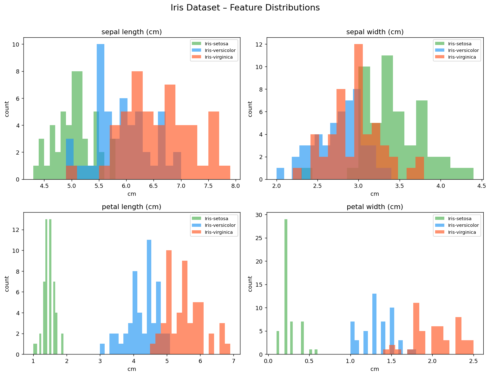
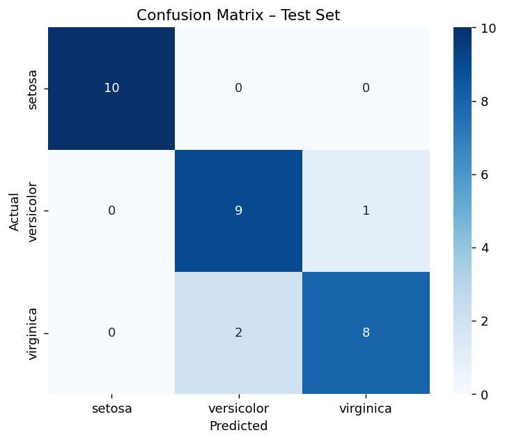
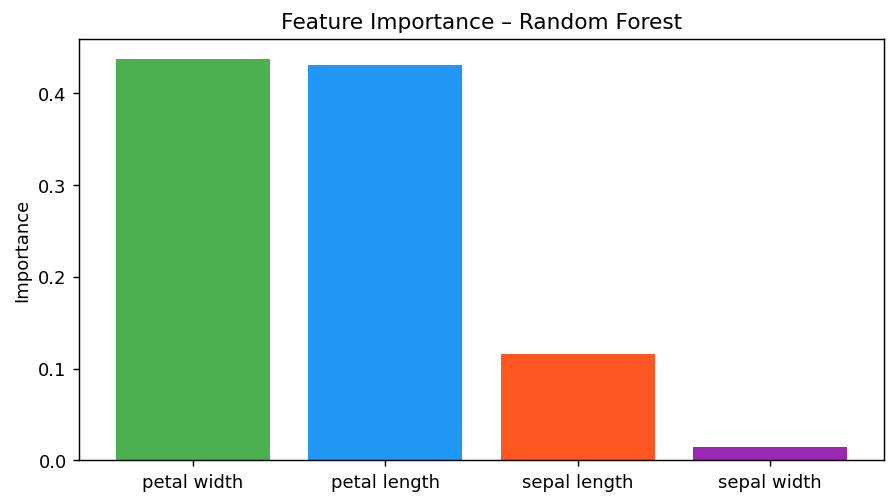
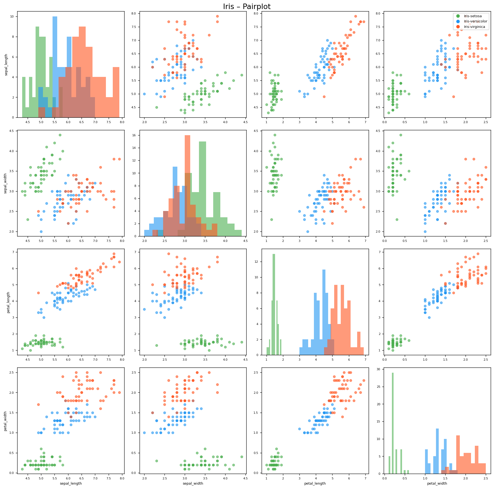

# Day 1 — Iris Flower Classification

**100 Days of ML/AI** · Phase 1: ML Foundations

---

## What this is

The Iris dataset is the "Hello World" of machine learning — 150 flowers, three species, four measurements. The goal is to correctly identify the species from sepal and petal dimensions.

I used it as a chance to build a proper end-to-end pipeline: data loading, EDA, training, evaluation, and a working web app on top.

---

## Dataset

**Source:** `sklearn.datasets.load_iris` (originally from UCI ML Repository)

- 150 samples, 4 features, 3 classes
- 50 samples per class — perfectly balanced, so no oversampling needed
- Features: sepal length, sepal width, petal length, petal width (all in cm)
- Target: Iris-setosa (0), Iris-versicolor (1), Iris-virginica (2)

---

## Approach

1. **EDA** — plotted feature distributions and a scatter of petal length vs width. Petal features separate the species much better than sepal features. Setosa is completely linearly separable; versicolor and virginica overlap.

2. **Preprocessing** — StandardScaler (mean=0, std=1). Not strictly necessary for Random Forest, but good habit since the same pipeline would break on other algorithms without it.

3. **Model** — Random Forest (100 trees). Works well out-of-the-box on small datasets, gives feature importance for free, and is robust to the slight feature correlation.

4. **Evaluation** — 80/20 train-test split (stratified), plus 5-fold cross-validation on the training set to get a more stable accuracy estimate.

---

## Results

| Metric | Value |
|--------|-------|
| CV Accuracy (5-fold) | 95.0% ± 1.7% |
| Test Accuracy | 90.0% |
| Setosa F1 | 1.00 |
| Versicolor F1 | 0.86 |
| Virginica F1 | 0.84 |

The 3 misclassifications are all between versicolor and virginica, which makes sense — they overlap in the petal feature space. The model gets every setosa correct.

**Most important feature:** petal length, by a significant margin.

---

## Screenshots

| Feature Distributions | Confusion Matrix |
|---|---|
|  |  |

| Feature Importance | Pairplot |
|---|---|
|  |  |

---

## Project structure

```
Day-001-Iris-Classification/
├── train.py            # training script — run this first
├── app.py              # Flask web app
├── notebook.ipynb      # full EDA + training walkthrough
├── requirements.txt
├── model.pkl           # saved after training
├── scaler.pkl          # saved after training
├── dataset/
│   └── iris.csv
└── screenshots/
    ├── feature_distributions.png
    ├── pairplot.png
    ├── confusion_matrix.png
    └── feature_importance.png
```

---

## How to run

```bash
# install dependencies
pip install -r requirements.txt

# train the model (creates model.pkl and scaler.pkl)
python train.py

# start the web app
python app.py
# then open http://localhost:5000
```

---

## Future improvements

- Try SVM with RBF kernel — usually squeezes out a few more percentage points on this dataset
- GridSearchCV for proper hyperparameter tuning
- Drop one of the two correlated petal features and see if it changes anything
- Deploy to Hugging Face Spaces or Render

---

## What I learned

- Stratified splits matter even on balanced datasets — good habit to build early
- Feature importance from Random Forest is a quick sanity check, not a substitute for proper analysis
- Versicolor vs virginica is genuinely hard. You'd need to look at a real botanist's decision rules to do better than ~90% consistently

---

**Stack:** Python · scikit-learn · pandas · matplotlib · seaborn · Flask
